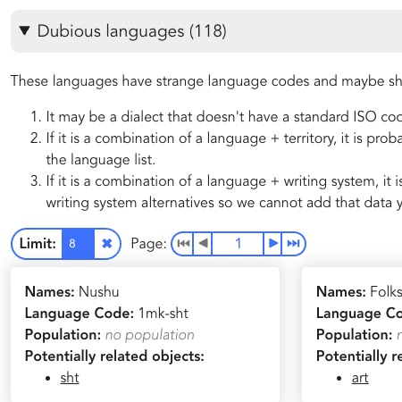

# *Lang*uage *Nav*igator

This repository contain a dataset about the world's languages and language-like objects as well as a website framework to visualize the information.

There are multiple ways to visualize the data
| Card List | Hierarchy | Table | Reports | Map |
| --------------------------------------------------------------------------- | ---------------------------------------------------------------------------- | -------------------------------------------------------------------- | ------------------------------------------------------------------------ | ---------------------------------------------------------------- |
|  |  |  |  |  |

## Project Overview

### Motivation

This website was put together to give an overview of the world's languages and language-related concepts. Similar to Ethnologue & Glottolog, the main differences of this are to:

- **Free** & open to all consumers.
- Show **all data**, even contested language definitions. Making sure to put contested data in context.
- Provide **actionable insights** -- make sure the data is clear enough that consumers can come to this page to get answers.

Common questions people will come to this resource for are:

- What's the language code for XXXX?
- What languages are used in country YYYY?
- What are the top languages in the world _given some criteria_.

### Tech Stack

- **Frontend**: The website is rendered in Javascript, particularly React using Typescript.
- **Backend**: The framework of the website Node and Vite.
- **Data**: Data files are written in Tab-separated-value format (tsv).

### Partners

We've partnered with various organizations to get data and to provide data to. UNESCO's [World Atlas of Languages](https://en.wal.unesco.org/), [Digital Language Vitality](https://hlt.bme.hu/en/dld/), and [Unicode CLDR](https://cldr.unicode.org/)

## Data

The data comes from multiple sources, primarily [CLDR](https://github.com/unicode-org/cldr/), [Ethnologue](https://www.ethnologue.com/), and [Glottolog](https://glottolog.org/).

## Development Instructions

In order to generate the website on an internal server, follow these instructions.

1. Install Node Project Manager, see [the official Node documentation for install](https://docs.npmjs.com/downloading-and-installing-node-js-and-npm)
2. Download the repository to your computer -- go to that folder when you are done
3. Run `npm install` to install relevant Node and Vite packageas
4. Run `npm run dev` to start the server with some dev options
   1. or `npm run build` for the public version
5. Depending on what port is used, the website can now be accessed using a local browser at a URL like http://localhost:5173/

See [onboarding.md](docs/onboarding.md) for more detailed instructions on setting up a development environment.

## How to contribute

See [contributing.md](docs/contributing.md) for details on how to contribute to this project.

## Roadmap

See [roadmap.md](docs/roadmap.md) for the planned features and timeline of major versions.

## License

- The code in this repository is licensed under the [MIT License](LICENSE).
- The language data, visualizations, and other content are licensed under [Creative Commons Attribution-ShareAlike 4.0 International](https://creativecommons.org/licenses/by-sa/4.0/).
