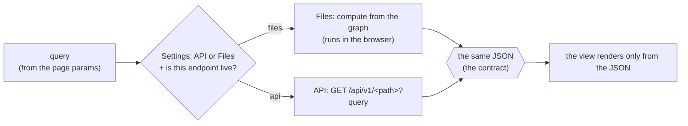
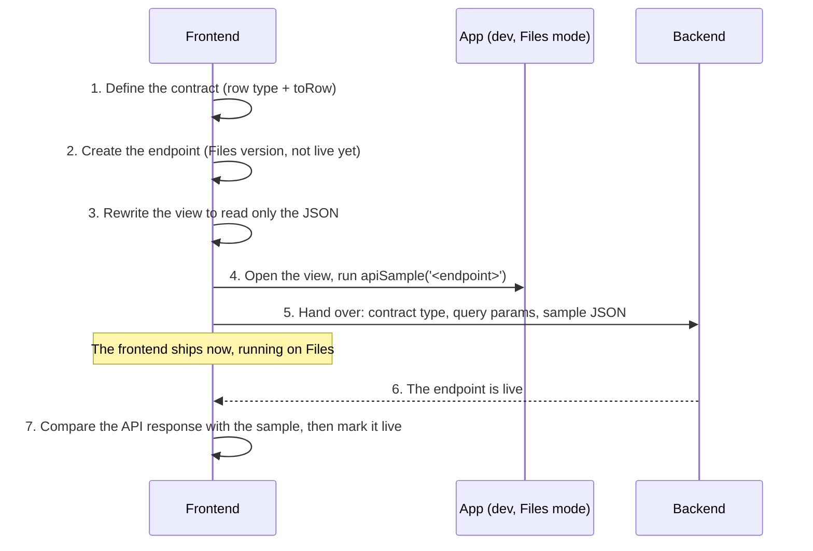

# Wiring a view to the API

LangNav is moving from building everything in the browser (load the TSV files, build the entity
graph, filter and sort it) to fetching ready-made JSON from the LangNav API. Both ways of loading
data have to work side by side for a long time, so each view moves over on its own, behind its own
flag.

This guide shows how to move one view. You never wait for the backend: you build and ship the
frontend first, hand the backend a spec and a sample, and mark the endpoint live once they're done.

## The idea

Each view gets an **endpoint**: a query goes in, JSON comes out. The endpoint has two
implementations that return exactly the same JSON:



- **The Files implementation is the reference implementation of the API.** It is also your mock:
  since it already produces the exact response, you don't need a separate mock server.
- **The view never touches the graph.** It only reads the JSON, so switching sources doesn't
  change the view.
- **Each endpoint goes live on its own.** Settings has a Data Source choice: API (the default) or
  Files. In API mode, an endpoint uses the API only once it's marked live in `endpoints.ts`; until
  then it stays on Files, so a view never breaks while its backend is being built.

## The workflow



## Worked example: the Writing Systems table

The Writing Systems table is the smallest complete example. Copy it when you wire a new table.

| File                                                       | What it holds                                     |
| ---------------------------------------------------------- | ------------------------------------------------- |
| `src/features/data/api/writingsystem/writingSystemList.ts` | Contract, `toRow`, query, Files version, endpoint |
| `src/widgets/tables/columns/WritingSystemColumns.tsx`      | Columns that read only the row                    |
| `src/widgets/tables/WritingSystemTable.tsx`                | Calls the endpoint and renders `RowTable`         |
| `src/features/data/api/core/endpoints.ts`                  | One `LIVE` line                                   |

The Territories table (`territoryList.ts`) is the second example. It adds an entity-specific query
param (`territoryScopes`) and cells that still need the graph.

### Names and folders

An endpoint is named `<entity><View>`, matching the backend's `<Entity>List` / `<Entity>Detail`
views: `languageList`, `languageDetail`, later `languageMap` or `languageHierarchy`. The List
endpoint serves both the table and the card list. The file, hook and query follow the name
(`territoryList.ts`, `useTerritoryList`, `toTerritoryListQuery`).

```text
src/features/data/api/
  core/           defineEndpoint, apiClient, endpoints (LIVE)
  list/           tableContract, useTablePageFromFiles: shared by every List endpoint
  <entity>/       one file per endpoint, e.g. writingsystem/writingSystemList.ts
```

Entity folder names match `src/entities/` (`territory`, `writingsystem`, `language`...). Keep the
entity prefix in file names, so editor tabs and search results stay unambiguous.

### Step 1: Define the contract

Go through each column's current `render(ent)` and put into the row **exactly the values that render
reads, already computed**. Graph walks move into `toRow` now, and into the backend later.

```ts
/** One row of the Writing Systems table: the contract for GET writing-systems/. */
export type WritingSystemRow = BaseRow & {
  populationUpperBound?: number;
  /** Largest first. Undefined when unknown, which renders as an empty cell. */
  languages?: EntityRef[];
  keyboardNames?: string[];
  territoryOfOrigin?: EntityRef;
  countryNames?: string[];
};

export function toWritingSystemRow(ws: WritingSystemData): WritingSystemRow {
  return {
    id: ws.ID,
    code: ws.codeDisplay,
    name: ws.nameDisplay,
    endonym: ws.nameEndonym,
    populationUpperBound: ws.populationUpperBound,
    languages:
      ws.languages &&
      Object.values(ws.languages)
        .sort(sortByPopulation)
        .map((l) => ({ id: l.ID, name: l.nameDisplay })),
    // ...
  };
}
```

Rules for rows:

- **Plain JSON only**: strings, numbers, booleans, arrays and objects. No class instances, no
  functions, no `Date`.
- **Every row is `BaseRow & {...}`** (`id`, `code`, `name`, `endonym?`). That gives you the shared
  Pin, Code, Name and Endonym columns for free.
- **A related entity becomes an `EntityRef`** (`{ id, name }`), never the entity itself.
- **Send values, not presentation.** Send `landArea: 12345.678` and format it in the column.
  Derived values that only combine fields of the same row (such as density) can stay in the column.
- **Keep the difference between empty and missing** when the UI shows them differently (for
  example `languages?: EntityRef[]`: `undefined` renders nothing, `[]` renders `0`).
- **Document each field in the type.** The type is the spec the backend reads.

### Step 2: Create the endpoint

In the same file:

```ts
/** The page params GET writing-systems/ must honor. */
export function toWritingSystemListQuery(params: PageParams): Record<string, string> {
  return toBasePageQuery(params);
}

function useWritingSystemListFromFiles() {
  return useTablePageFromFiles(useDataContext().writingSystems, toWritingSystemRow);
}

export const useWritingSystemList = defineEndpoint(
  'writingSystemList',
  'writing-systems/',
  useWritingSystemListFromFiles,
);
```

And add it to `LIVE` in `endpoints.ts`, as not live yet:

```ts
const LIVE = {
  // ...
  writingSystemList: false, // true once the backend serves the contract
};
```

About the query:

- `toBasePageQuery` covers what every table honors: paging, sorting, search, pinned rows,
  population range and the connection filters.
- Add entity-specific params on top, e.g. `{ ...toBasePageQuery(params), territoryScopes: ... }`.
- **Rule: any param that changes which rows appear, their order, or a value inside a row must be in
  the query.** For example, Territories sends `languageSource` because the language names in a row
  depend on it.

### Step 3: Rewrite the view to read only the JSON

Columns become `TableColumn<YourRow>` and read only the row:

```tsx
// before
render: (ent) => <HoverableEnumeration items={ent.outputKeyboards?.map((kb) => kb.nameDisplay)} />,
// after
render: (row) => <HoverableEnumeration items={row.keyboardNames} />,
```

- Use `CodeRowColumn`, `NameRowColumn`, `EndonymRowColumn` from `RowColumns.tsx`. The pin column is
  added automatically.
- For an `EntityRef`, use `<HoverableEntityRef entRef={ref} />`.
- Keep the column keys and order unchanged. Column visibility is stored in URLs by position.

The table component is always the same shape:

```tsx
const WritingSystemTable: React.FC = () => {
  const params = usePageParams();
  const query = useMemo(() => toWritingSystemListQuery(params), [params]);
  const { state, fetch } = useWritingSystemList(query);
  const columns = useMemo(getWritingSystemColumns, []);

  return (
    <RowTable
      tableID={TableID.WritingSystems}
      columns={columns}
      state={state}
      getAllRows={async () => (await fetch(allRowsQuery(query))).rows}
    />
  );
};
```

`RowTable` handles loading and errors, the meter, the column selector and the export. Export asks
the endpoint for every filtered row (`allRowsQuery`), so it works the same on Files and on the API.

**Migrate a whole view at once.** Don't mix graph columns and row columns in one table. Mixing
needs two render paths, and we've tried it: it costs more than converting the remaining columns.

### Step 4: Get the sample JSON

Run the app (`npm run dev`), open the view with some interesting settings (a sort, a search, a
second page), then in the browser console:

```js
apiSample('writingSystemList'); // { path, query, response } for what's on screen
apiSample('writingSystemList', { limit: '5' }); // same, with page/limit overrides
copy(apiSample('writingSystemList')); // Chrome/Edge: copy it to the clipboard
```

`apiSample` exists only in dev builds, only in Files mode (switch Data Source to Files in Settings),
and only after you've opened a view that uses that endpoint.

Only `page` and `limit` can be overridden. For any other setting (sort, search, filters,
`languageSource`), change it in the app and call `apiSample` again: the Files version reads those
from the page, so an override would be ignored.

### Step 5: Hand over to the backend

Give the backend team:

1. **The path:** `GET /api/v1/writing-systems/`.
2. **The contract:** the row type with its field comments. Every table responds with
   `TablePage<Row>`:

   ```ts
   { total: number;  // rows before any filter
     count: number;  // rows after filters (pinned rows included), across all pages
     rows: Row[] }   // the requested page
   ```

3. **The query params** from `toXPageQuery`, with the rules the Files version follows:
   - `limit < 1` means no limit.
   - A `page` past the end returns page 1.
   - Pinned rows come first, in pin order, and skip the filters.
4. **One or more sample files** from step 4, as test fixtures. Include one taken with the view's
   default settings: its `sortBy` is the view's default sort, which the endpoint must support.
   (The Writing Systems view sorts by `Population (Writing)` by default, not `Population`.)
5. **The order of every list, including ties.** A list sorted by population also has an order
   among equal populations, and the UI can show it: the Languages cell displays the first
   language. Say what breaks ties, or the backend will pick something else.

The frontend is finished at this point. Ship it on Files.

### Step 6: Compare, then mark it live

Once the backend endpoint exists:

1. Call it with the query from a sample and compare the response with the sample's `response`.
   Compare every row, not just the first page (`apiSample('x', { limit: '-1' })`), and under each
   `languageSource` (switch it in the app) if names or populations depend on it. Any difference is
   either a backend bug or a data question to settle before flipping.
2. Set it to `true` in `LIVE` (`endpoints.ts`). In API mode the view now uses the API.
3. Check it in the browser: the Settings menu's Data Source switches between API and Files (the
   page reloads). A table's wrapper shows `data-row-source="api"` or `"files"`, and the Network tab
   shows the request.

On the API, a failed request shows an inline error. It never falls back to Files silently. While a
new query loads, the view keeps the previous data and shows a small spinner in the corner.

Production builds must set `VITE_LANGNAV_API_URL` to the deployed backend, since API is the default
data source for every visitor.

## Testing

- **While migrating columns**, keep a temporary copy of the old columns file and assert that each
  new column renders the same text as the old one for every mock entity (`render(ent)` versus
  `render(toRow(ent))`), with and without a search. Delete the copy when you're done.
- **Permanently**, test that the rows survive a JSON round trip, and that the same `RowTable` fed by
  an API endpoint (MSW serving the Files JSON) renders the same rows. See
  `src/widgets/tables/__tests__/TerritoryTable.test.tsx`.
- Use `defineEndpoint(name, path, useFiles, EndpointSource.API)` in tests to force a source. The
  Settings choice is read once, when the page loads; to start a test in Files mode, set
  `localStorage 'data-source'` to `files` in `vi.hoisted`, before the endpoint modules load.

## Things that still need the graph

Some cells need more than their row, such as hover cards, the census hover, and the UNESCO export
button. They look the entity up by id (`HoverableEntityRef`, and `WithTerritory` in
`TerritoryColumns.tsx`) and fall back to plain text when the graph isn't loaded. They keep working
today, and each one marks where a future endpoint (for example an entity detail endpoint) will be
needed before the TSV pipeline can be removed.

The "N filtered out" hover breakdown isn't shown in row tables yet. It would need breakdown counts
in the contract.

## Non-table views

The pattern has two layers. Only the second one is table-specific.

| Layer       | Pieces                                                                                                                                              | Used by               |
| ----------- | --------------------------------------------------------------------------------------------------------------------------------------------------- | --------------------- |
| Core        | `defineEndpoint` (query in, JSON out), the Files version as mock and reference, the per-endpoint `LIVE` switch, `apiSample()`, compare then go live | Every view            |
| Table layer | `TablePage`, `useTablePageFromFiles`, `RowTable`, row columns, `toBasePageQuery`, `allRowsQuery`                                                    | Tables and card lists |

For any other view, follow the same six steps with a contract shaped for that view: write a Files
hook that returns `(query) => response`, wrap it in `defineEndpoint`, and render only from
`state.data`.

### Worked example: the Writing System details

`src/features/data/api/writingsystem/writingSystemDetail.ts` and `src/widgets/details/WritingSystemDetails.tsx`.

- **Path parameters.** The path is `writing-systems/{id}/`. `defineEndpoint` fills `{id}` from the
  query and sends the rest as URL params.
- **The contract is the body of the view.** Every value it shows, with related entities as
  `EntityRef` and every list already in display order.
- **The query carries whatever changes the output.** Here that's the `languageSource` (names depend
  on it) and the page sort (the related lists follow `sortBy`), even though it's a single entity.
- **The Files version sorts from the query, not from page params.** It uses
  `getSortFunctionParameterized`, and it copies lists before sorting. Sorting the entity's own
  arrays in place makes tie order depend on earlier renders.
- **Loading and errors belong to the view.** Render a loading state and an inline error, like
  `RowTable` does.

### Contracts by view

| View      | Contract                                               | Files version                       | Notes                                              |
| --------- | ------------------------------------------------------ | ----------------------------------- | -------------------------------------------------- |
| Table     | `TablePage<XRow>`                                      | filter + page + `toXRow`            | Done for Territories and Writing Systems           |
| Card list | usually the same `TablePage`, maybe fewer fields       | same as the table                   | Reuses the table layer                             |
| Map       | `{ points: { id, name, lat, lng, value }[] }`          | filtered entities to points         | Same filter query as the table                     |
| Chart     | aggregated series, e.g. `{ bins: { label, value }[] }` | filtered entities, then aggregate   | Same filter query as the table                     |
| Details   | `XDetail`, one per page section for deep pages         | `getEntity(id)` to the detail shape | Done for Writing Systems. Hover cards can reuse it |
| Hierarchy | `{ id, name, scope, children: [...] }`                 | tree walk                           |                                                    |
| Reports   | one small contract per report                          | each report's current logic         | Editor tools; they can stay on Files longest       |

Two rules keep this from turning back into "ship the graph":

1. **One contract per view, filtering shared underneath.** Map, cards, chart and table all start
   from the same filtered set. The filter rules live once on the backend; each view's endpoint
   returns only the fields that view shows.
2. **Split deep pages by section.** A page like Language details walks the graph in many
   directions. One endpoint per section keeps each contract small and lets sections move to the
   API one at a time.
