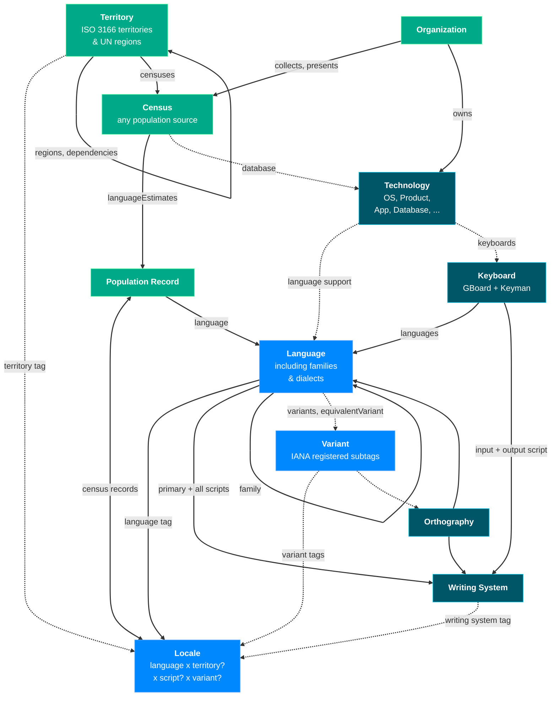
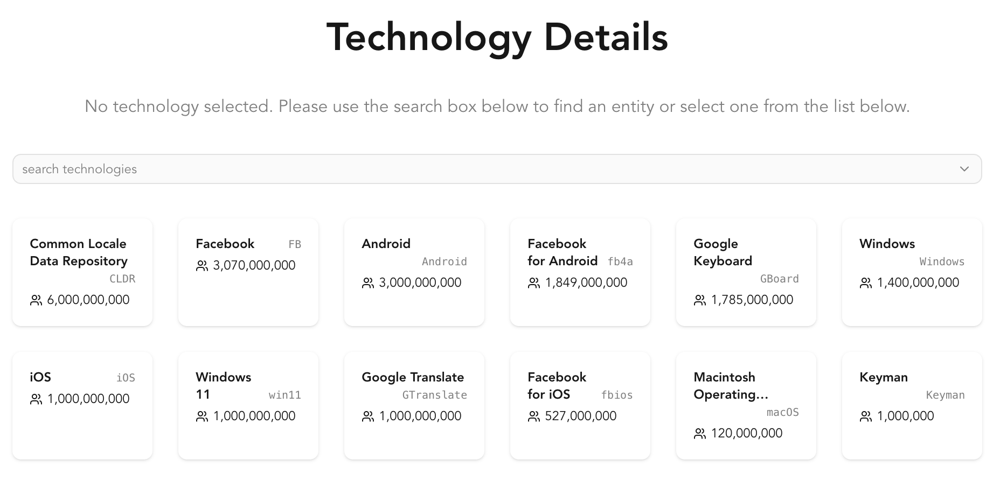
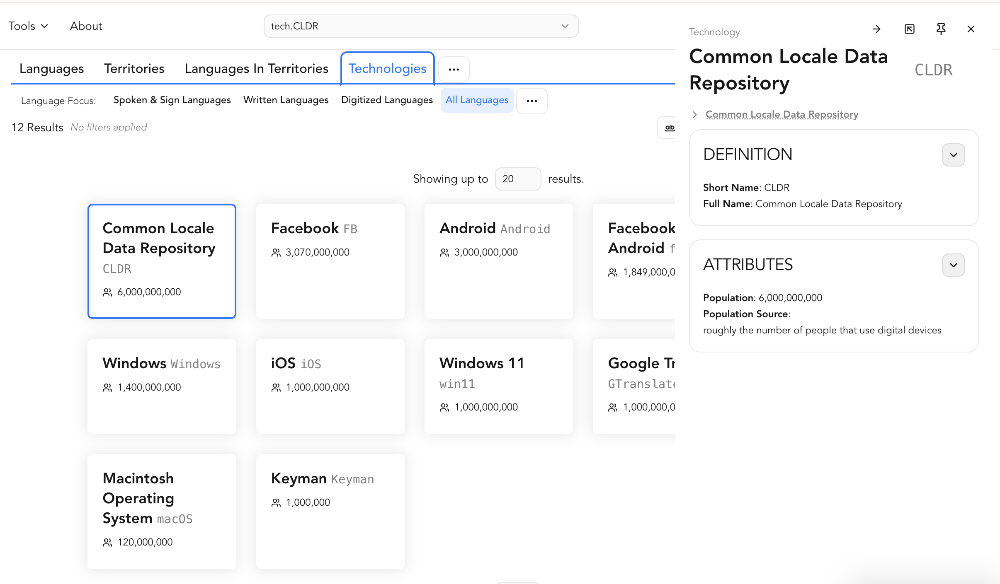
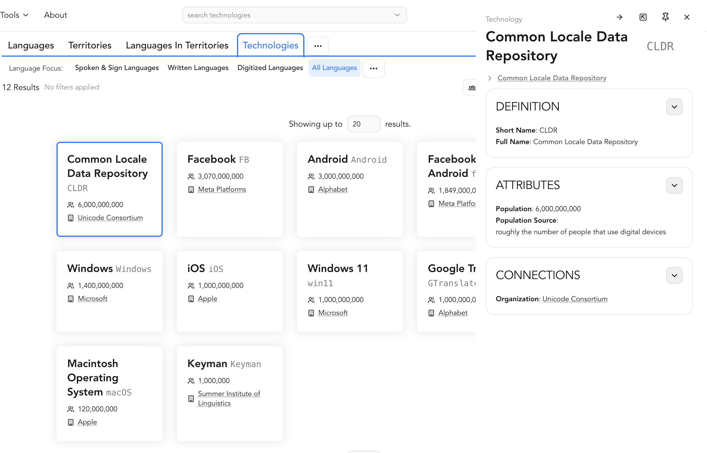

# Entity

LangNav organizes data objects as Entities. An entity represents a kind of data with common metadata.

Some metadata has objects of very different scope, `LanguageData` while called "language" includes language families and dialects as well -- distinguished by the scope parameter. Similarly, `TerritoryData` includes geographic entities from continents to insular dependencies. However every object in within an entity class has the same structure and can reuse the same components and rendering logic.

## Current Entities

Here is a visualization of the entities supported by LangNav today. Entities have many edges, this is just showing the most useful ones.

## What Entities should have

Entities should be visible in most of the presentation modes:

- Cards in CardList & MiniCardList
- Details with a full inventory of metadata
  - Also visible in Drawer, which can be a separate rendering component or fallback to the regular Details view
- Table, with columns for most if not all metadata fields
- _maybe_ Chart if there is data that can be plotted on axes
- _maybe_ Map view if it can be effectively displayed on a map of the world
- _maybe_ Hierarchy view if the entity has a clear parent-child relationships with other entities or within itself

While it is a bit overkill for some kinds of entities (like how many people need to see a card list of the organizations with data on LangNav?) -- it provides transparency about our data and makes it easier for users to easily navigate between kinds of entities in the system.

We also have the concept of Fields -- some are specific to a particular entity (like the Writing System Scope or Medium of Use) but some are common (Name, Population, Endonym). `getField` and `getSpecificFieldsForEntityType` should return corresponding fields.

One superpower of LangNav is our ability to easily make hovercards that provide quick access to key information about an entity without needing to navigate away from the current view. The component `<HoverableEntityName>` can be used to easily provide information

## Adding a New Entity

When you are adding a new entity, you don't need to do it all in 1 PR. Here's a potential workflow:

1. Add types, loading mechanisms, field getters, and cards
2. Add connections to other entities & displays in those entities about this entity.
3. Add a details & drawer views for the new entity.
4. Add optional views like Chart, Map, and Hierarchy if applicable.
5. Verify how the entity works with various filters
6. Add a field for how other entities connect to this one (eg. the "Languages" spoken in a "Territory")
   1. You can also use this in a filter view (eg. you choose "Territory" and it shows the "Language"s present there)

You can do this across multiple pull requests or in a comprehensive pull request -- whichever fits your workflow and the complexity of the new entity. Just be careful to make sure the reviewer does not need to process too much context at once, otherwise they may miss errors or they may give too much feedback and slow down the implementation more than if it was done piecewise.

### ID

One thing that works in LangNav's favor today is that Languages, Writing Systems, Territories, and Locales use ID patterns that do not overlap: xx/xxx/xxxx0000 versus Xxxx versus XX/000 versus xxx_XX/xxx_000/xxxx0000_XX/etc. However, every time we add a new entity we're adding it to the master list of IDs, and we need to ensure that the new ID pattern does not conflict with existing ones. For particular entities, it is probably best to prefix the ID with the entity type but then the codeDisplay does not need to show the prefix. For instance, Organizations are all prefixed `org.` like `org.UN`.

### Step by Step

This section will provide a file-by-file guide on how to add a new entity to the LangNav system, detailing which files need to be modified and what changes are typically required in each. It was written in 2026-09 when we added the Technology entity. There may be other changes required for different entities or new updates in how we handle them. Substitute the symbol `*` for the actual entity name you are adding.

#### Commit 1: Add Types

1. Add folder to the entities directory `src/entities/`, add a `*Types.ts` file for the entity's `*Data.ts` definition.
   1. Feel free to copy a previous entity data type like `OrganizationData` and add/remove fields -- just make sure to keep `type`
   2. Feel welcome to include comments to clarify what some of the fields mean. For instance, we have `ID` and `codeDisplay` field -- the `ID` field should be unique amongst all entity types, the `codeDisplay` is what the end-user sees in LangNav.
   3. As we load in data, some data is a key to a different entity, keep 2 different fields for those, a raw key field and an optional resolved entity reference. For instance, `parentLanguageCode` and `parentLanguage`.
   4. Add relevant enums or constants for the entity, such as `*Scope` if there are different ways to measure the scope.
2. Update `EntityType` and `EntityData` in `src/entities/types/EntityTypes.ts` to include the new entity.
3. Update switch statements and other files that require the new entity -- it's easy to run `npm run build` to see which areas need definition.
   1. In order to avoid tackling too many changes in 1 PR, feel free to leave stubs to get back to, it's often good to label them TODO comments so we can easily find and complete them later. For example, `getEntityMainTableColumns` can be tackled later.
   2. As you fill in the results for methods like `getEntityChildren` you may update your EntityData definition to include any new relationships or fields required by the entity.

At this point you can save the commit, using the check for build errors (and open the website, you won't see anything different yet) to make sure nothing is wrong.

#### Commit 2: Load Data

4. Prepare TSVs -- for technologies.tsv we're keeping a master of all technology data, but others like the censuses are too varied to easily maintain a master list in a tsv and are their metadata is defined as headers in each of the files.
   1. While sometimes you come in with a pre-defined TSV, for some of the manual lists I just keep a Google Drive spreadsheet available with the data for easier editing then I copy-paste it to the TSV.
   2. The data will go into the repository in `public/data/...` -- if its manually curated data from Translation Commons put it in the `tc` folder, but if it comes from another source, put it in an appropriate directory
5. Add a `load*.ts` function and add it to the routines loaded in `CoreData.tsx`.
   1. Extra tsvs should be loaded in `SupplementalData.tsx`, with CoreData focused more on getting the entity structure.
   2. `loadEntitiesFromFile` handles most of entity cases, you just need to provide a function to convert raw lines into the `*Data` objects you declared before.
6. Check `getField` functions that load data from entities that they can retrieve the data from the new entity.
   1. For example, `getSourceForPopulationAsString` in `getEntityMiscFields.tsx` needed a new case to handle the new Technology entity type.
   2. Double check the values provided for your new entity by `getSpecificFieldsForEntityType` in `FieldApplicability.ts` to make sure the field can be queried.
   3. This is a good time to check the default sorting. Usually LangNav sorts by population and we assume most entities have a population, but entities like an Organization aren't well suited to be sorted by population. You can add an override in `Profiles.tsx`.

At this point you can save commit #2. Most visualizations (Cards, Hierarchy, Table, ...) are not available yet -- but you can see that the intended data was loaded by opening the automatically generated Minicards in the Details View manually setting the URL's entType to your new name eg. <http://localhost:5173/data?entType=Technology&view=Details>.

#### Commit 3: Basic Views

1. Add to `EntityTypeTabs` by including the new entity in the `ORDERED_OBJECTS` array so you can select this in the UI.
2. Add the `*Card` component -- like before you can copy from an existing card. Only include major fields that most users would want to see.
   1. You may want to make updates to `EntityFieldDisplay` and use that component as a common way to show information and avoiding custom components.
3. Add the `*Details` component -- this component should include ALL fields in the entity. Although we won't do connections quite yet -- just make a basic display.
   1. To start, we won't make a specific Drawer component -- and instead the Drawer will just display the `*Details` component for the entity.
   2. Initially, a good framework to structure the details is 3 sections: Definition, Attributes & Connections -- but consider bespoke information hierarchies matching the expected use-cases.

Now, you should able to test this by opening the Cards view, clicking on a card/minicard to open the Drawer view, and opening the details view. See the screenshot for the new Technology entities before we added connections: <http://localhost:5173/data?entType=Technology&view=Cards&entID=tech.CLDR>

#### Commit 4: Add Connections

At this point, we'll fill out the connections step of the entity loading processing & show the connections in the user interface. For our example new entity (TechnologyData) we'll add parent/child relationships, connections to Organizations, and connections to Keyboards.

1. This is a good time to update the entity diagram at the top of this file
2. If necessary, make modifications to existing TSVs.
   1. In our example, Organizations will now be connected to Technologies -- but some technologies in our initial set are missing organization entries, so we'll add them.
   2. Update the `*Type` files for the organizations to add new inbound edges to your new entity and make sure our new entity has the right outbound edges. Sometimes there may be data explosion so we won't make explicit inbound and/or outbound connections.
3. Add connections to the loading steps
   1. Add a new file `src/features/data/connect/connect*.ts` that takes in new associations
   2. Update `connectEntities.tsx` with the new connections
   3. Update other connection methods if the linking will happen from there -- eg. connectKeyboards will now also add connections of keyboards -> technologies.
   4. Usually it is added to the end, but you may order it differently if you want earlier dependencies.
4. Update field getters
   1. Check `getField.ts` definitions that call related entities -- note that this function focuses on primitive values (eg. display names).
   2. Sometimes we'll want to add the singular or plural `get*ForEntity` method in `getEntityConnection.ts` that can handle different input entity types and return the relevant new entity/ies.
5. Update the `*Cards` and `*Details` components to include the new connections.
6. This is a good time to update the entity diagram at the top of this file

Depending on the complexity or side effects, this may actually be more work than 1 commit. For instance, when adding TechnologyData, it was better to handle the tech<->tech links and tech<->org links first, then update the keyboard changes. I didn't even make the tech<->language connections because that will be worth its own PR.

You can should test this by

#### Commits 5+: Other View Modes (Table, Hierarchy, Chart)

It's often good to do 1 commit/view

1. Table
   1. Add a new `TableID` at the end of the list (since its an increasing key)
   2. Add columns in `*Columns.tsx` -- tip: use `CommonColumns.tsx` and `getFieldColumn` to decrease how much bespoke code you need to write.
   3. Make `*Table.tsx` (is this is a necessary step?)
   4. Call the new table component in `ViewTable.tsx`.
2. Charts
   1. If we expect people want to use the scatterplot to compare quantitative aspects of the entity, then set a good default X and Y axis in `getDefaultParams` in `Profiles.tsx`.
   2. If there isn't enough quantitative data for the entity, then add it to `UNSUPPORTED_ENTITY_TYPES` in `ViewChart.tsx`.
3. Hierarchy
   1. Make a new file `*Hierarchy.tsx`
   2. Define the root nodes (often parent-less nodes, but sometimes we'll use other ents like organizations for the top level of the technology hierarchy).
   3. Then make getters that translate ents to their `TreeNodeData` -- it's often good to do this in 2 steps, 1 converts a single to information and 1 converts a list of ents (like a list of child ents) to their `TreeNodeData[]` array.
4. Map
   1. The map works for entities with defined lat/long coordinates (we can use circles) or entities that have a strong country component (we can use choropleth coloring).
   2. We need a separate document to explain how to add it.
   3. If the entity type is not supported for mapping, add it to the `UNSUPPORTED_ENTITY_TYPES` array in `ViewMap.tsx`.

#### Future commits

Other ideas

1. Tools/Reports
   1. These are bespoke components that help debug issues or go into in-depth analysis.
   2. Add a `ReportID` and `Report` component similar to how we handle other reports.
2. Add new Field definitions -- this enables us to use sorting, coloring, and filtering based on this data.
   1. Add a filter selector for relevant connected objects
3. Add Tests
   1. `MockEntities.tsx` similuates a small LangNav by makiing mock data inspired from Lord of the Rings. This helps in testing various components and views without relying on real data. The most impactful test it does is to test our various accessors and sorting with `sortMocks.test.tsx` -- however that is a very large test at this point and we should only add to it when adding new Field definitions, not necessarily new entities.
