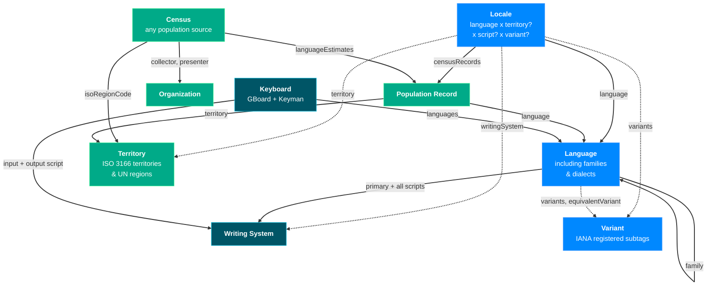

# Entity

LangNav organizes data objects as Entities. An entity represents a kind of data with common metadata.

Some metadata has objects of very different scope, `LanguageData` while called "language" includes language families and dialects as well -- distinguished by the scope parameter. Similarly, `TerritoryData` includes geographic entities from continents to insular dependencies. However every object in within an entity class has the same structure and can reuse the same components and rendering logic.

## Current Entities

Here is a visualization of the entities supported by LangNav today. Entities have many edges, this is just showing the most useful ones.

## What Entities should have

Entities should be visible in most of the presentation modes:
* Cards in CardList & MiniCardList
* Details with a full inventory of metadata
  * Also visible in Drawer, which can be a separate rendering component or fallback to the regular Details view
* Table, with columns for most if not all metadata fields
* [maybe] Chart if there is data that can be plotted on axes
* [maybe] Map view if it can be effectively displayed on a map of the world
* [maybe] Hierarchy view if the entity has a clear parent-child relationships with other entities or within itself

While it is a bit overkill for some kinds of entities (like how many people need to see a card list of the organizations with data on LangNav?) -- it provides transparency about our data and makes it easier for users to easily navigate between kinds of entities in the system.

We also have the concept of Fields -- some are specific to a particular entity (like the Writing System Scope or Medium of Use) but some are common (Name, Population, Endonym). `getField` and `getSpecificFieldsForEntityType` should return corresponding fields.

One superpower of LangNav is our ability to easily make hovercards that provide quick access to key information about an entity without needing to navigate away from the current view. The component `<HoverableEntityName>` can be used to easily provide information

## Adding a New Entity

When you are adding a new entity, you don't need to do it all in 1 PR. Here's a potential workflow:

1. Add types, loading mechanisms, field getters, and cards
2. Add connections to other entities & displays in those entities about this entity.
3. Add a details & drawer views for the new entity.
4. Add optional views like Chart, Map, and Hierarchy if applicable.
5. Verify how the entity works with various filters
6. Add a field for how other entities connect to this one (eg. the "Languages" spoken in a "Territory")
  1. You can also use this in a filter view (eg. you choose "Territory" and it shows the "Language"s present there)

You can do this across multiple pull requests or in a comprehensive pull request -- whichever fits your workflow and the complexity of the new entity. Just be careful to make sure the reviewer does not need to process too much context at once, otherwise they may miss errors or they may give too much feedback and slow down the implementation more than if it was done piecewise.

### ID

One thing that works in LangNav's favor today is that Languages, Writing Systems, Territories, and Locales use ID patterns that do not overlap: xx/xxx/xxxx0000 versus Xxxx versus XX/000 versus xxx_XX/xxx_000/xxxx0000_XX/etc. However, every time we add a new entity we're adding it to the master list of IDs, and we need to ensure that the new ID pattern does not conflict with existing ones. For particular entities, it is probably best to prefix the ID with the entity type but then the codeDisplay does not need to show the prefix. For instance, Organizations are all prefixed `org.` like `org.UN`.

### Step by Step

This section will provide a file-by-file guide on how to add a new entity to the LangNav system, detailing which files need to be modified and what changes are typically required in each. It was written in 2026-09 when we added the Technology entity. There may be other changes required for different entities or new updates in how we handle them. Substitute the symbol `*` for the actual entity name you are adding.

1. Add folder to the entities directory `src/entities/`, add a `*Types.ts` file for the entity's `*Data.ts` definition.
   1. Feel free to copy a previous entity data type like `OrganizationData` and add/remove fields -- just make sure to keep `type`
   2. Feel welcome to include comments to clarify what some of the fields mean. For instance, we have `ID` and `codeDisplay` field -- the `ID` field should be unique amongst all entity types, the `codeDisplay` is what the end-user sees in LangNav.
   3. As we load in data, some data is a key to a different entity, keep 2 different fields for those, a raw key field and an optional resolved entity reference. For instance, `parentLanguageCode` and `parentLanguage`.
   4. Add relevant enums or constants for the entity, such as `*Scope` if there are different ways to measure the scope.
2. Update `EntityType` and `EntityData` in `src/entities/types/EntityTypes.ts` to include the new entity.
3. Prepare TSVs -- for technologies.tsv we're keeping a master of all technology data, but others like the censuses are too varied to easily maintain a master list in a tsv and are their metadata is defined as headers in each of the files.
   1. While sometimes you come in with a pre-defined TSV, for some of the manual lists I just keep a Google Drive spreadsheet available with the data for easier editing then I copy-paste it to the TSV.
   2. The data will go into the repository in `public/data/...` -- if its manually curated data from Translation Commons put it in the `tc` folder, but if it comes from another source, put it in an appropriate directory 
4. Update switch statements and other files that require the new entity -- it's easy to run `npm run build` to see which areas need definition.
   1. In order to avoid tackling too many changes in 1 PR, feel free to leave stubs to get back to, it's often good to label them TODO comments so we can easily find and complete them later. For example, `getEntityMainTableColumns` can be tackled later.
   2. As you fill in the results for methods like `getEntityChildren` you may update your EntityData definition to include any new relationships or fields required by the entity.
5. Add a `load*.ts` function and add it to the routines loaded in `CoreData.tsx`.
   1. Extra tsvs should be loaded in `SupplementalData.tsx`, with CoreData focused more on getting the entity structure.
   2. `loadEntitiesFromFile` handles most of entity cases, you just need to provide a function to convert raw lines into the `*Data` objects you declared before.
6. Add to the navigation & start basic views
   1. Add to `EntityTypeTabs` by including the new entity in the `ORDERED_OBJECTS` array.
   2. Add the `EntityCard`
   3. Text our the automated `Minicard` -- open the details page
   4. This is a good time to check the default sorting. Usually LangNav sorts by population and we assume most entities have a population, but entities like an Organization aren't well suited to be sorted by population. You can add an override in `Profiles.tsx`.
7. Add to other view modes
8. Add Tools/Reports -- these help debug issues or go into in-depth analysis about different entities.
9. Add Tests
   1. `MockEntities.tsx` similuates a small LangNav by makiing mock data inspired from Lord of the Rings. This helps in testing various components and views without relying on real data. The most impactful test it does is to test our various accessors and sorting with `sortMocks.test.tsx` -- however that is a very large test at this point and we should only add to it when adding new Field definitions, not necessarily new entities.